# 🏏 ICC Cricket World Cup 2023 – EDA (India Focused)
This repository presents **Exploratory Data Analysis (EDA)** of the ICC Cricket World Cup 2023, with a special focus on **Team India’s performance**.  

---

## 📌 Project Snapshot
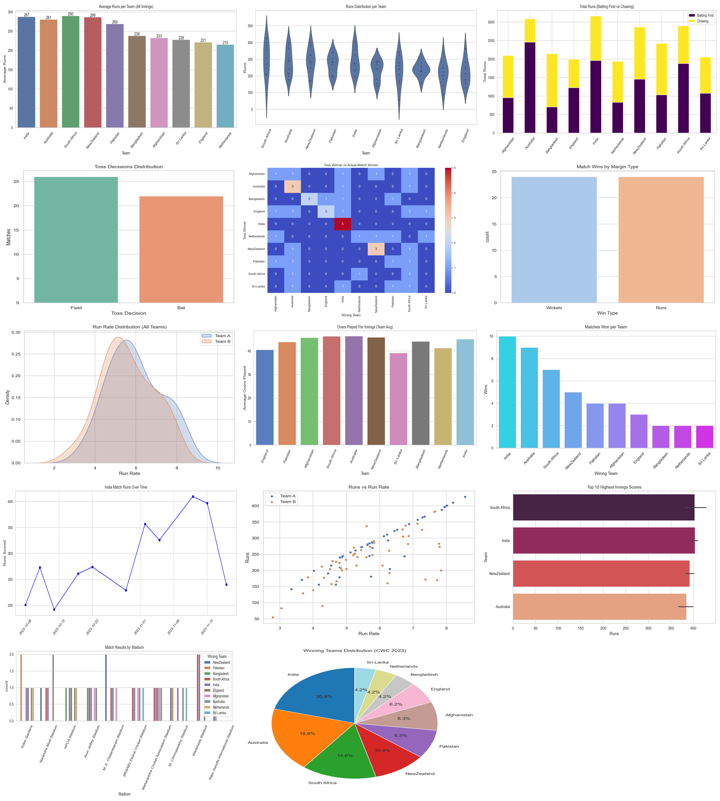

*A single snapshot of all 14 visualizations — presenting the complete analytical story of the 2023 World Cup.*

---

## 📊 Visual Insights

### Average Runs per Team
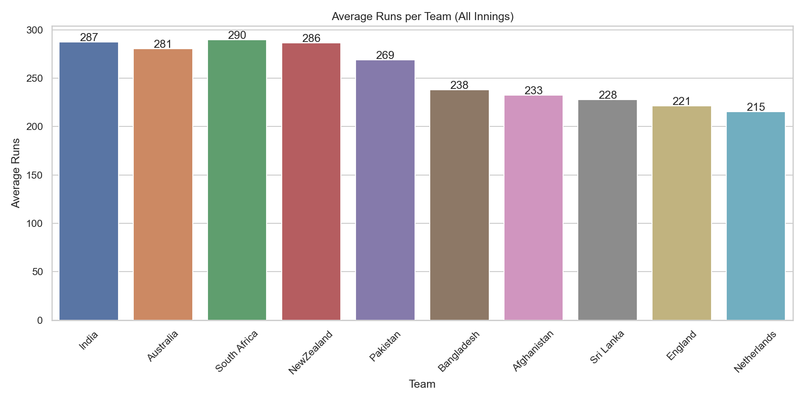  
**Insight:** Teams with higher averages show stronger batting depth; **India ranks top** — indicates consistent top-order performance.

---

### Score Distribution by Team
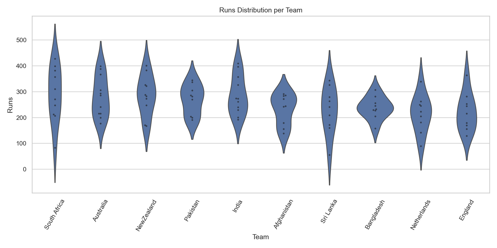  
**Insight:** South Africa & India show **higher medians and long tails** — capable of explosive big totals.

---

### Total Runs Stacked by Innings
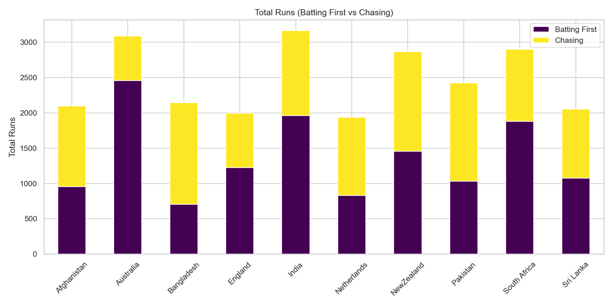  
**Insight:** Median runs are consistent across innings — matches often went deep; bowling performances were variable.

---

### Toss Decision vs Match Outcome
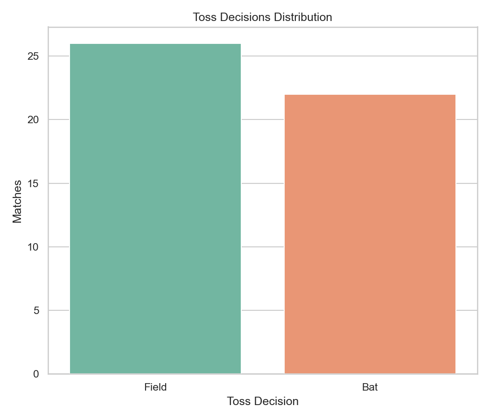  
**Insight:** Toss decision isn’t decisive; **India often wins regardless** — adaptability is a key strength.

---

### Toss Winner vs Match Winner
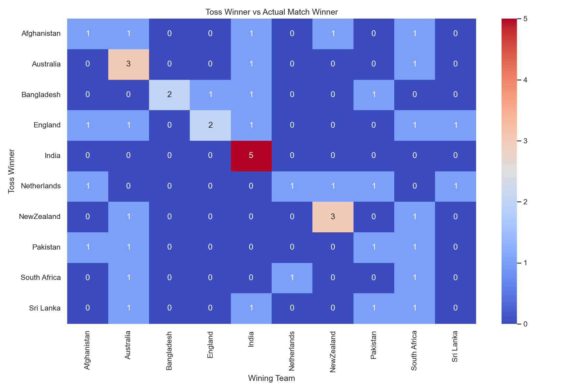  
**Insight:** Winning the toss does **not guarantee match wins** — execution matters more than the toss.

---

### Margin of Victory Type
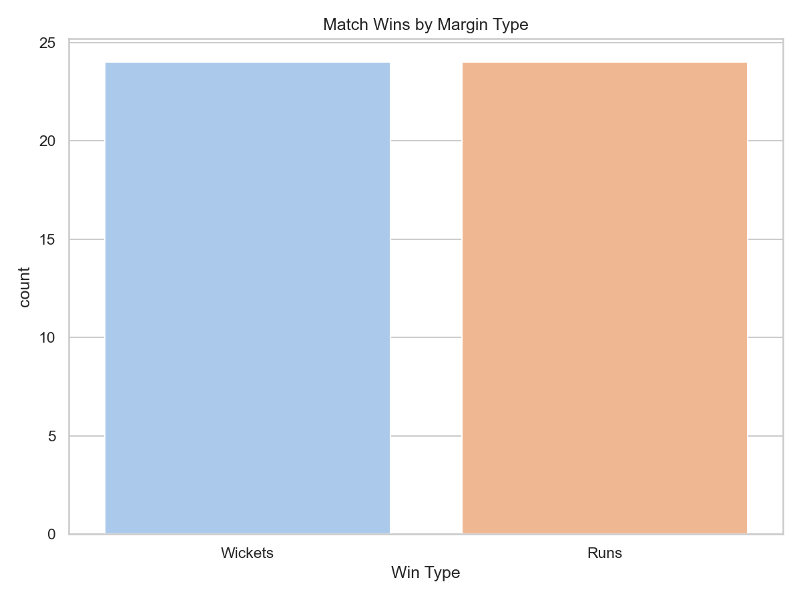  
**Insight:** India has higher **run-margin wins**, showing dominance while defending totals.

---

### Runrate Distribution
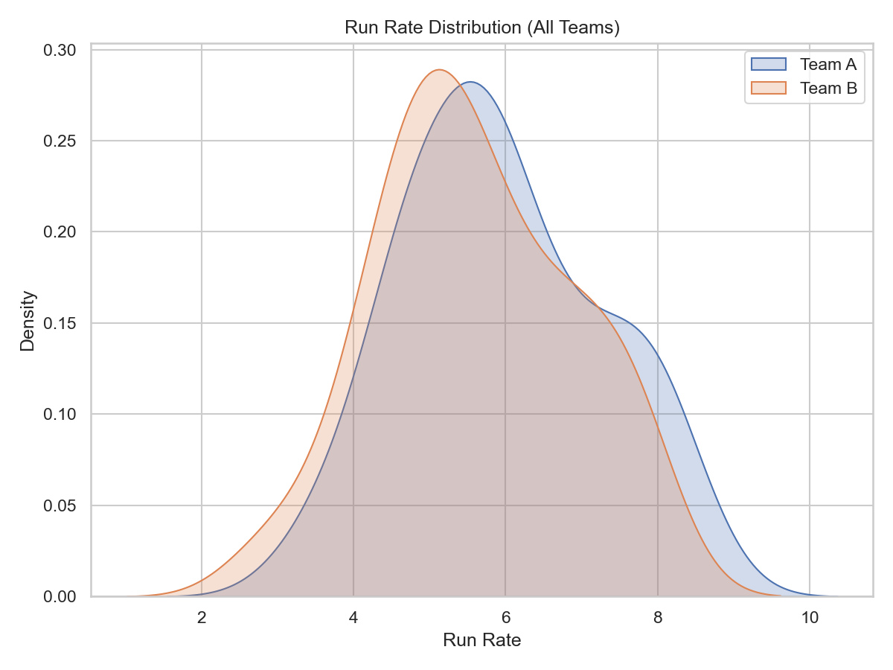  
**Insight:** Teams chasing often show late acceleration; India’s **controlled acceleration** is evident.

---

### Average Overs Faced per Team
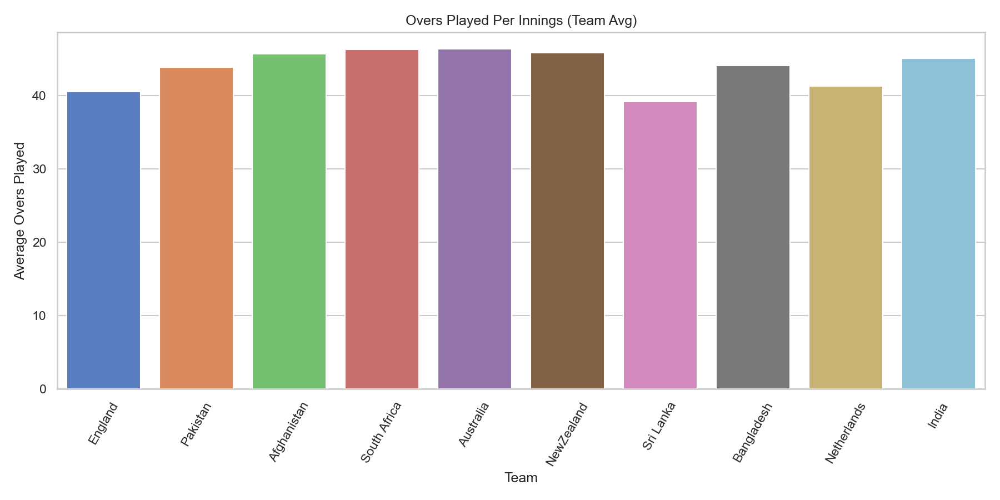  
**Insight:** India & New Zealand consistently **bat full overs** — highlights batting stability.

---

### Matches Won by Teams
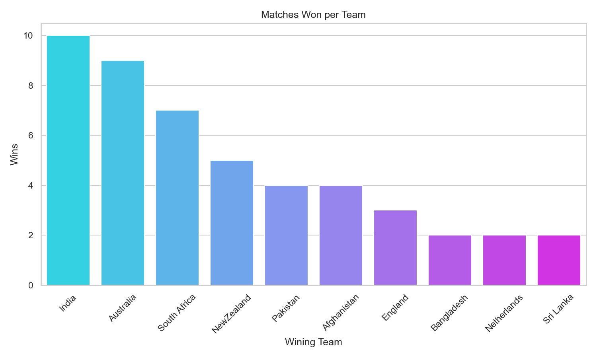  
**Insight:** India leads in total matches won — the most consistent team throughout the tournament.

---

### India’s Match Trends
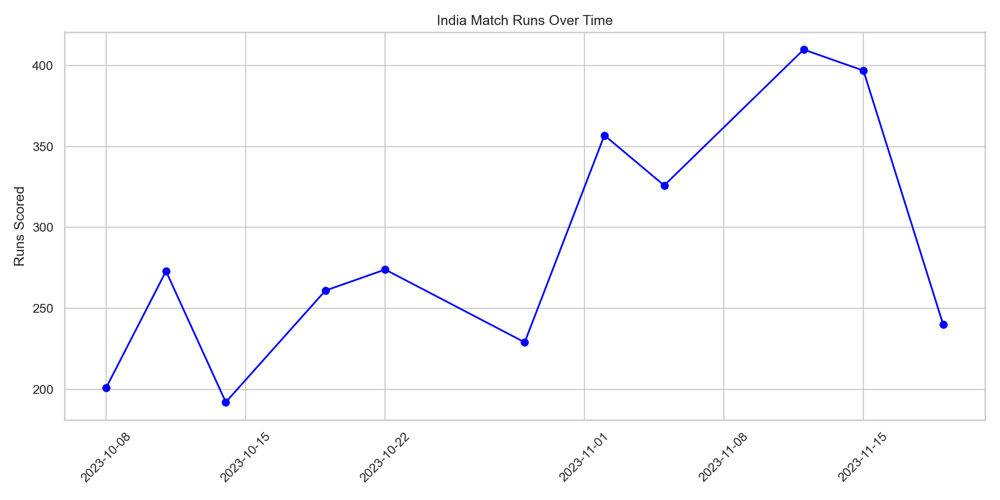  
**Insight:** India frequently sits **above tournament averages** — outperforming peers in both runs and efficiency.

---

### Runs vs Runrate
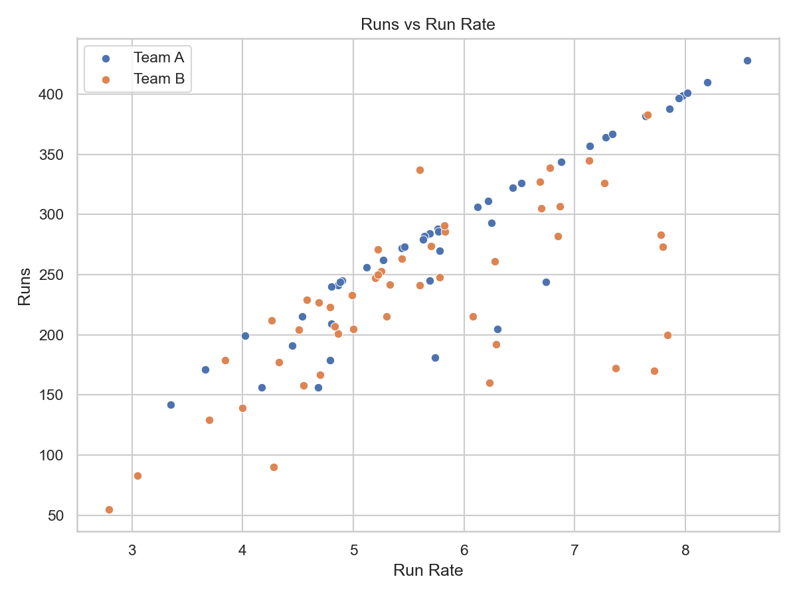  
**Insight:** Positive correlation: **higher runrates → higher totals**; India excels in balancing strike rate with partnerships.

---

### Top Individual Scores
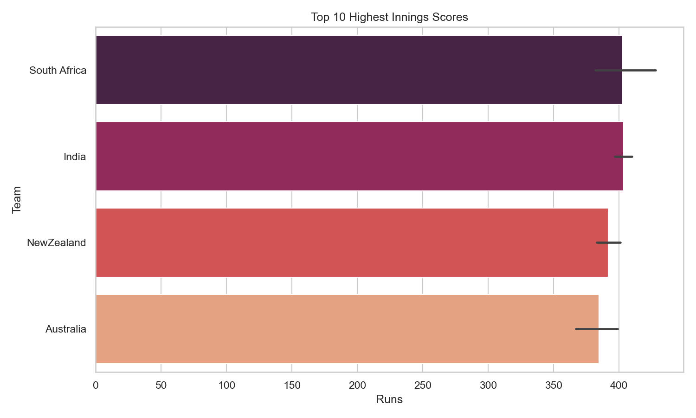  
**Insight:** India & South Africa dominate the list — star players carry momentum with match-winning knocks.

---

### Results by Stadium
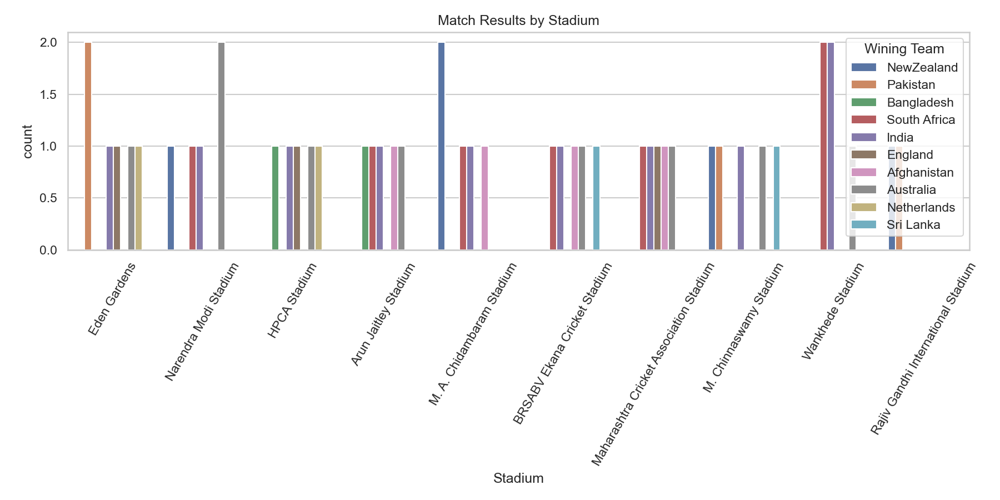  
**Insight:** India shows adaptability across venues — not reliant on home advantage.

---

### Winning Teams Distribution
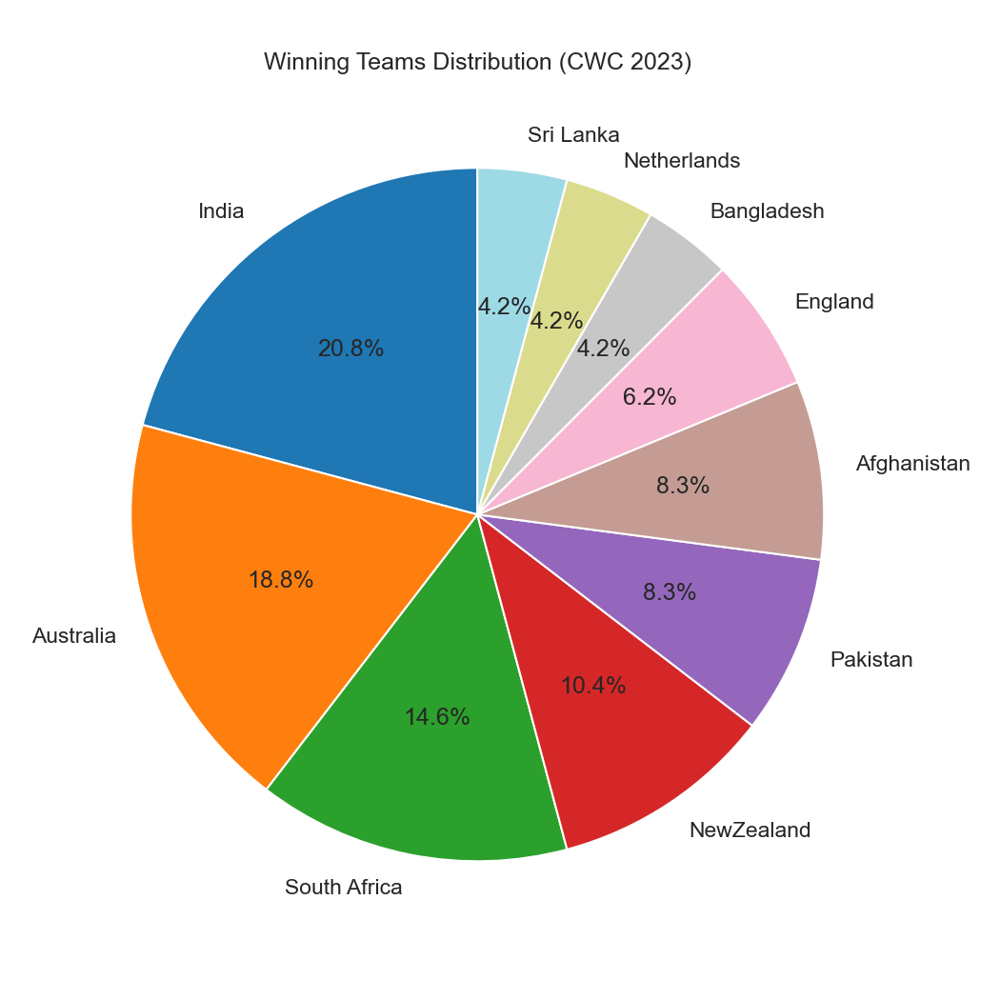  
**Insight:** India dominates the winners circle — **tournament’s most consistent and clutch team**.

---

## 🚀 Key Takeaways for India
- India dominated both **batting first and chasing** scenarios.  
- Adaptability across toss decisions and venues gave a clear edge.  
- **Boundary hitting + controlled wickets** = India’s winning formula.  
- Extras control and run-rate acceleration remain critical insights for strategy.  

---
## Acknowledgements
- Kaggle

---

## 👤 Author
- Syed Abdul Waheed
- Data Science Enthusiast | Python Developer | Automation Explorer
- 📬 Connect: LinkedIn (https://www.linkedin.com/in/syed-abdul-waheed/)

--- 

